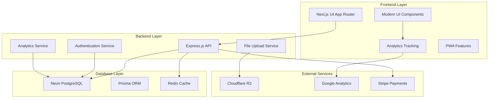

# Design Document

## Overview

This design document outlines the comprehensive modernization and enhancement of the MJ CHAUFFAGE e-commerce platform. The design focuses on creating a cutting-edge 2025 user experience while fixing critical functionality issues, implementing advanced analytics, and ensuring production-ready performance. The solution leverages the existing Next.js 14 and Express.js architecture while introducing modern design patterns, improved database integration, and comprehensive tracking capabilities.

## Architecture

### System Architecture Overview



### Technology Stack Modernization

**Frontend Enhancements:**
- Next.js 14 with App Router (existing)
- Modern React 18 patterns with Suspense and Server Components
- Tailwind CSS with 2025 design system
- Framer Motion for micro-interactions
- React Query for state management and caching
- Progressive Web App (PWA) capabilities

**Backend Optimizations:**
- Express.js with TypeScript (existing)
- Prisma ORM with PostgreSQL migration
- Redis for session management and caching
- Real-time capabilities with Socket.io
- Comprehensive logging with Winston

**Database Migration:**
- Migrate from SQLite to Neon PostgreSQL
- Optimize schema for performance
- Implement connection pooling
- Add database monitoring

## Components and Interfaces

### 1. Modern Design System (2025 Standards)

#### Color Palette Enhancement
```typescript
// Enhanced 2025 Color System
const colorSystem = {
  primary: {
    // Sophisticated blue gradient system
    50: '#f0f9ff',
    500: '#0ea5e9', // Main brand
    900: '#0c4a6e',
  },
  accent: {
    // Modern orange with better contrast
    500: '#f3761a',
    gradient: 'linear-gradient(135deg, #f3761a 0%, #e45a10 100%)',
  },
  neutral: {
    // Improved neutral scale for 2025
    50: '#fafbfc',
    100: '#f4f6f8',
    900: '#0f172a',
  },
  semantic: {
    success: '#22c55e',
    warning: '#f59e0b',
    error: '#ef4444',
    info: '#3b82f6',
  }
}
```

#### Typography System
```typescript
// Modern Typography Scale
const typography = {
  fontFamily: {
    sans: ['Inter Variable', 'system-ui', 'sans-serif'],
    display: ['Cal Sans', 'Inter Variable', 'sans-serif'],
  },
  fontSize: {
    'display-2xl': ['4.5rem', { lineHeight: '1.1', letterSpacing: '-0.02em' }],
    'display-xl': ['3.75rem', { lineHeight: '1.2', letterSpacing: '-0.02em' }],
    'heading-xl': ['2.25rem', { lineHeight: '1.3', letterSpacing: '-0.01em' }],
    'body-lg': ['1.125rem', { lineHeight: '1.6' }],
    'body-sm': ['0.875rem', { lineHeight: '1.5' }],
  }
}
```

#### Component Design Patterns

**Modern Card Components:**
```typescript
interface ModernCardProps {
  variant: 'elevated' | 'outlined' | 'filled' | 'glass';
  hover: 'lift' | 'glow' | 'scale' | 'none';
  radius: 'sm' | 'md' | 'lg' | 'xl';
}

// Glass morphism effects for premium feel
const glassCard = {
  background: 'rgba(255, 255, 255, 0.1)',
  backdropFilter: 'blur(10px)',
  border: '1px solid rgba(255, 255, 255, 0.2)',
}
```

**Interactive Elements:**
```typescript
// Micro-interactions for buttons
const buttonAnimations = {
  hover: {
    scale: 1.02,
    boxShadow: '0 8px 25px rgba(0, 0, 0, 0.15)',
    transition: { duration: 0.2 }
  },
  tap: { scale: 0.98 },
  loading: {
    opacity: [1, 0.7, 1],
    transition: { repeat: Infinity, duration: 1.5 }
  }
}
```

### 2. Enhanced User Interface Components

#### Navigation System
- **Mega Menu**: Modern dropdown with product categories, featured items, and quick actions
- **Breadcrumb Navigation**: Enhanced with structured data for SEO
- **Mobile Navigation**: Slide-out drawer with smooth animations
- **Search**: Instant search with autocomplete and filters

#### Product Display Components
- **Product Cards**: Modern grid layout with hover effects and quick actions
- **Product Gallery**: Zoom functionality, 360° view support, and video integration
- **Comparison Tool**: Side-by-side comparison with highlighting differences
- **Reviews System**: Star ratings, photo reviews, and verified purchase badges

#### Shopping Experience
- **Smart Cart**: Persistent cart with real-time updates and recommendations
- **Wishlist**: Visual wishlist with sharing capabilities
- **Checkout Flow**: Multi-step checkout with progress indicator and guest checkout
- **Order Tracking**: Real-time order status with delivery tracking

### 3. Admin Dashboard Modernization

#### Dashboard Layout
```typescript
// Modern admin layout structure
const adminLayout = {
  sidebar: {
    width: '280px',
    collapsible: true,
    sections: ['Overview', 'Products', 'Orders', 'Customers', 'Analytics', 'Settings']
  },
  header: {
    height: '64px',
    features: ['Search', 'Notifications', 'Profile', 'Theme Toggle']
  },
  content: {
    padding: '24px',
    maxWidth: '1400px',
    responsive: true
  }
}
```

#### Data Visualization
- **Charts**: Modern chart library (Recharts) with interactive tooltips
- **Metrics Cards**: KPI cards with trend indicators and sparklines
- **Tables**: Advanced data tables with sorting, filtering, and pagination
- **Real-time Updates**: Live data updates using WebSocket connections

### 4. Analytics Integration Components

#### Tracking Components
```typescript
// Analytics tracking hooks
interface AnalyticsEvent {
  category: 'ecommerce' | 'navigation' | 'engagement';
  action: string;
  label?: string;
  value?: number;
  customData?: Record<string, any>;
}

// Page view tracking
const usePageTracking = () => {
  // Track page views, session duration, bounce rate
}

// E-commerce tracking
const useEcommerceTracking = () => {
  // Track purchases, cart actions, product views
}
```

#### Analytics Dashboard
- **Real-time Metrics**: Live visitor count, active sessions, current revenue
- **Traffic Analysis**: Source breakdown, geographic data, device analytics
- **Conversion Funnel**: Step-by-step conversion tracking with drop-off analysis
- **Revenue Analytics**: Sales trends, product performance, customer lifetime value

## Data Models

### Enhanced Database Schema

#### Analytics Tables
```sql
-- Page Analytics
CREATE TABLE page_analytics (
  id UUID PRIMARY KEY DEFAULT gen_random_uuid(),
  session_id VARCHAR(255) NOT NULL,
  user_id UUID REFERENCES users(id),
  page_path VARCHAR(500) NOT NULL,
  page_title VARCHAR(255),
  referrer VARCHAR(500),
  user_agent TEXT,
  device_type VARCHAR(50),
  browser VARCHAR(100),
  os VARCHAR(100),
  country VARCHAR(100),
  city VARCHAR(100),
  duration_seconds INTEGER,
  bounce BOOLEAN DEFAULT false,
  created_at TIMESTAMP DEFAULT NOW()
);

-- E-commerce Analytics
CREATE TABLE ecommerce_events (
  id UUID PRIMARY KEY DEFAULT gen_random_uuid(),
  session_id VARCHAR(255) NOT NULL,
  user_id UUID REFERENCES users(id),
  event_type VARCHAR(50) NOT NULL, -- 'view_item', 'add_to_cart', 'purchase', etc.
  product_id UUID REFERENCES products(id),
  category_id UUID REFERENCES categories(id),
  value DECIMAL(10,2),
  currency VARCHAR(3) DEFAULT 'DZD',
  quantity INTEGER,
  metadata JSONB,
  created_at TIMESTAMP DEFAULT NOW()
);

-- Traffic Sources
CREATE TABLE traffic_sources (
  id UUID PRIMARY KEY DEFAULT gen_random_uuid(),
  session_id VARCHAR(255) NOT NULL,
  source VARCHAR(100), -- 'google', 'facebook', 'direct', etc.
  medium VARCHAR(100), -- 'organic', 'cpc', 'social', etc.
  campaign VARCHAR(200),
  utm_source VARCHAR(100),
  utm_medium VARCHAR(100),
  utm_campaign VARCHAR(200),
  utm_term VARCHAR(200),
  utm_content VARCHAR(200),
  created_at TIMESTAMP DEFAULT NOW()
);
```

#### Performance Optimization Tables
```sql
-- Cache Management
CREATE TABLE cache_entries (
  key VARCHAR(255) PRIMARY KEY,
  value TEXT NOT NULL,
  expires_at TIMESTAMP,
  created_at TIMESTAMP DEFAULT NOW()
);

-- Error Logging
CREATE TABLE error_logs (
  id UUID PRIMARY KEY DEFAULT gen_random_uuid(),
  level VARCHAR(20) NOT NULL,
  message TEXT NOT NULL,
  stack_trace TEXT,
  user_id UUID REFERENCES users(id),
  session_id VARCHAR(255),
  url VARCHAR(500),
  user_agent TEXT,
  created_at TIMESTAMP DEFAULT NOW()
);
```

### Data Migration Strategy

#### SQLite to PostgreSQL Migration
```typescript
// Migration script structure
const migrationPlan = {
  phase1: {
    description: 'Schema migration',
    steps: [
      'Update Prisma schema to PostgreSQL',
      'Generate migration files',
      'Create new database structure'
    ]
  },
  phase2: {
    description: 'Data migration',
    steps: [
      'Export existing SQLite data',
      'Transform data for PostgreSQL',
      'Import data with validation'
    ]
  },
  phase3: {
    description: 'Validation and optimization',
    steps: [
      'Verify data integrity',
      'Create indexes for performance',
      'Update connection strings'
    ]
  }
}
```

## Error Handling

### Comprehensive Error Management

#### Frontend Error Boundaries
```typescript
// Global error boundary with user-friendly messages
interface ErrorBoundaryState {
  hasError: boolean;
  error?: Error;
  errorInfo?: ErrorInfo;
}

class GlobalErrorBoundary extends Component<Props, ErrorBoundaryState> {
  // Catch JavaScript errors anywhere in the component tree
  // Log errors to analytics service
  // Display fallback UI with recovery options
}
```

#### API Error Handling
```typescript
// Standardized API error responses
interface APIError {
  code: string;
  message: string;
  details?: any;
  timestamp: string;
  requestId: string;
}

// Error handling middleware
const errorHandler = (error: Error, req: Request, res: Response) => {
  // Log error with context
  // Return appropriate HTTP status
  // Send user-friendly error message
  // Track error in analytics
}
```

#### Database Error Recovery
```typescript
// Connection retry logic
const databaseConfig = {
  retries: 3,
  retryDelay: 1000,
  connectionTimeout: 5000,
  fallbackStrategies: ['cache', 'static-data', 'error-page']
}
```

### User Experience Error Handling

#### Graceful Degradation
- **Offline Support**: Service worker for offline functionality
- **Loading States**: Skeleton screens and progressive loading
- **Error Recovery**: Retry mechanisms and alternative actions
- **Fallback Content**: Default content when data fails to load

## Testing Strategy

### Comprehensive Testing Approach

#### Unit Testing
```typescript
// Component testing with React Testing Library
describe('ProductCard Component', () => {
  test('displays product information correctly', () => {
    // Test product data rendering
    // Test price formatting
    // Test image loading
  });
  
  test('handles add to cart action', () => {
    // Test cart integration
    // Test loading states
    // Test error handling
  });
});
```

#### Integration Testing
```typescript
// API integration tests
describe('Product API', () => {
  test('fetches products with filters', async () => {
    // Test API endpoints
    // Test data transformation
    // Test error responses
  });
});
```

#### End-to-End Testing
```typescript
// E2E testing with Playwright
describe('E-commerce Flow', () => {
  test('complete purchase journey', async ({ page }) => {
    // Test product browsing
    // Test cart functionality
    // Test checkout process
    // Test order confirmation
  });
});
```

#### Performance Testing
```typescript
// Performance monitoring
const performanceMetrics = {
  coreWebVitals: {
    LCP: '< 2.5s', // Largest Contentful Paint
    FID: '< 100ms', // First Input Delay
    CLS: '< 0.1' // Cumulative Layout Shift
  },
  customMetrics: {
    timeToInteractive: '< 3s',
    firstMeaningfulPaint: '< 1.5s',
    bundleSize: '< 250KB gzipped'
  }
}
```

### Analytics Testing
```typescript
// Analytics event testing
describe('Analytics Tracking', () => {
  test('tracks page views correctly', () => {
    // Test page view events
    // Test user session tracking
    // Test conversion events
  });
  
  test('tracks e-commerce events', () => {
    // Test product view tracking
    // Test purchase tracking
    // Test cart abandonment tracking
  });
});
```

## Implementation Architecture

### Modern Development Patterns

#### Server Components and Client Components
```typescript
// Server Components for SEO and performance
export default async function ProductPage({ params }: { params: { id: string } }) {
  const product = await getProduct(params.id);
  return (
    <div>
      <ProductInfo product={product} />
      <ProductGallery images={product.images} />
      <AddToCartButton productId={product.id} /> {/* Client Component */}
    </div>
  );
}
```

#### State Management Strategy
```typescript
// Zustand for client state
interface CartStore {
  items: CartItem[];
  addItem: (item: CartItem) => void;
  removeItem: (id: string) => void;
  clearCart: () => void;
}

// React Query for server state
const useProducts = (filters: ProductFilters) => {
  return useQuery({
    queryKey: ['products', filters],
    queryFn: () => fetchProducts(filters),
    staleTime: 5 * 60 * 1000, // 5 minutes
  });
}
```

#### Real-time Features
```typescript
// WebSocket integration for real-time updates
const useRealTimeUpdates = () => {
  useEffect(() => {
    const socket = io('/admin');
    
    socket.on('orderUpdate', (order) => {
      // Update order status in real-time
    });
    
    socket.on('inventoryUpdate', (product) => {
      // Update product inventory
    });
    
    return () => socket.disconnect();
  }, []);
}
```

This design provides a comprehensive foundation for modernizing the MJ CHAUFFAGE e-commerce platform with 2025 design standards, robust analytics, and production-ready architecture.