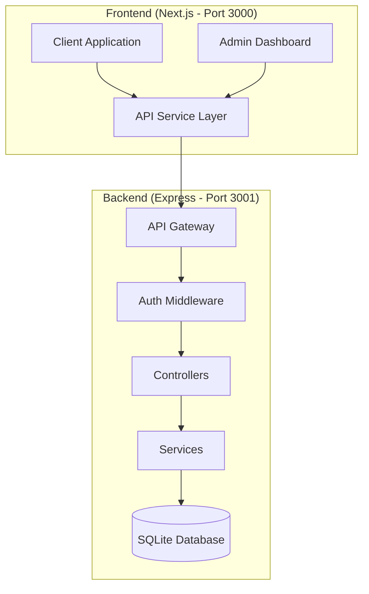
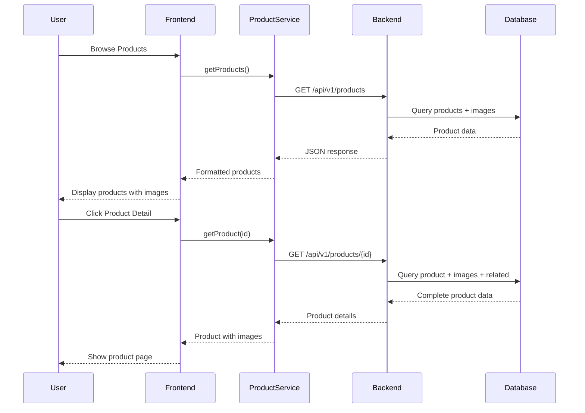
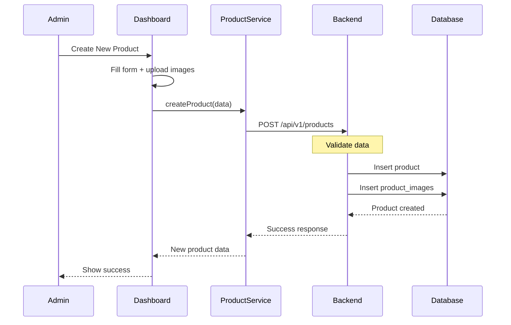

# API Architecture Schematic - MJ CHAUFFAGE

## 🏗️ System Overview



## 📍 API Endpoints Structure

### Base URLs
- **Frontend**: `http://localhost:3000`
- **Backend API**: `http://localhost:3001/api/v1`

## 🛒 Product Management Flow



## 📊 Admin Dashboard Flow



## 🔐 Authentication Flow

```mermaid
graph LR
    subgraph "User Authentication"
        LOGIN[Login Page] --> AUTH_SERVICE[Auth Service]
        AUTH_SERVICE --> BACKEND_AUTH[/api/v1/auth/login]
        BACKEND_AUTH --> JWT[Generate JWT]
        JWT --> STORE[Store Token]
        STORE --> HEADERS[Add to Headers]
    end
    
    subgraph "Admin Authentication"
        ADMIN_LOGIN[Admin Login] --> ADMIN_AUTH[/api/v1/admin/login]
        ADMIN_AUTH --> ADMIN_JWT[Admin JWT]
        ADMIN_JWT --> ADMIN_STORE[Store Admin Token]
    end
```

## 📁 Complete API Routes Map

### 🛒 **Products API**
| Method | Endpoint | Description | Frontend Usage |
|--------|----------|-------------|----------------|
| GET | `/api/v1/products` | List all products | `ProductService.getProducts()` |
| GET | `/api/v1/products/:id` | Get single product | `ProductService.getProduct(id)` |
| POST | `/api/v1/products` | Create product (admin) | `ProductService.createProduct()` |
| PUT | `/api/v1/products/:id` | Update product (admin) | `ProductService.updateProduct()` |
| DELETE | `/api/v1/products/:id` | Delete product (admin) | `ProductService.deleteProduct()` |
| GET | `/api/v1/products/featured` | Get featured products | `ProductService.getFeaturedProducts()` |
| GET | `/api/v1/products/categories` | Get categories | `ProductService.getCategories()` |
| GET | `/api/v1/products/manufacturers` | Get manufacturers | `ProductService.getManufacturers()` |

### 🛍️ **Cart API**
| Method | Endpoint | Description | Frontend Usage |
|--------|----------|-------------|----------------|
| GET | `/api/v1/cart` | Get user cart | `CartService.getCart()` |
| POST | `/api/v1/cart/items` | Add to cart | `CartService.addItem()` |
| PUT | `/api/v1/cart/items/:id` | Update quantity | `CartService.updateQuantity()` |
| DELETE | `/api/v1/cart/items/:id` | Remove item | `CartService.removeItem()` |
| DELETE | `/api/v1/cart/clear` | Clear cart | `CartService.clearCart()` |

### 📦 **Orders API**
| Method | Endpoint | Description | Frontend Usage |
|--------|----------|-------------|----------------|
| GET | `/api/v1/orders` | List user orders | `OrderService.getUserOrders()` |
| GET | `/api/v1/orders/:id` | Get order details | `OrderService.getOrder()` |
| POST | `/api/v1/orders` | Create order | `OrderService.createOrder()` |
| PUT | `/api/v1/orders/:id/status` | Update status (admin) | `OrderService.updateStatus()` |

### 👤 **Authentication API**
| Method | Endpoint | Description | Frontend Usage |
|--------|----------|-------------|----------------|
| POST | `/api/v1/auth/register` | User registration | `AuthService.register()` |
| POST | `/api/v1/auth/login` | User login | `AuthService.login()` |
| POST | `/api/v1/auth/logout` | User logout | `AuthService.logout()` |
| GET | `/api/v1/auth/profile` | Get profile | `AuthService.getProfile()` |
| PUT | `/api/v1/auth/profile` | Update profile | `AuthService.updateProfile()` |

### 🔧 **Admin API**
| Method | Endpoint | Description | Frontend Usage |
|--------|----------|-------------|----------------|
| POST | `/api/v1/admin/login` | Admin login | `AdminService.login()` |
| GET | `/api/v1/admin/dashboard` | Dashboard stats | `AdminService.getStats()` |
| GET | `/api/v1/admin/orders` | All orders | `AdminService.getOrders()` |
| GET | `/api/v1/admin/customers` | All customers | `AdminService.getCustomers()` |
| GET | `/api/v1/admin/analytics` | Analytics data | `AdminService.getAnalytics()` |

## 🗂️ Data Models

### Product Model
```typescript
interface Product {
  id: string
  name: string
  slug: string
  sku: string
  description: string | null
  price: number
  salePrice: number | null
  stockQuantity: number
  categoryId: string
  manufacturerId: string | null
  images: ProductImage[]
  features: string | null
  specifications: string | null
  isActive: boolean
  isFeatured: boolean
  createdAt: Date
  updatedAt: Date
}

interface ProductImage {
  id: string
  productId: string
  url: string
  altText: string | null
  sortOrder: number
}
```

## 🔄 Frontend Services Structure

```
frontend/src/services/
├── productService.ts       # Product CRUD operations
├── cartService.ts          # Cart management
├── authService.ts          # User authentication
├── orderService.ts         # Order management
├── adminService.ts         # Admin operations
└── api.ts                  # Base API configuration
```

## 🎯 Key Integration Points

### 1. **Product Display Pages**
- **Home Page** → Featured products → `GET /api/v1/products/featured`
- **Products Page** → All products → `GET /api/v1/products`
- **Product Detail** → Single product → `GET /api/v1/products/:id`

### 2. **Admin Dashboard**
- **Products Management** → CRUD operations
- **Orders Management** → Order status updates
- **Customer Management** → Customer data
- **Analytics** → Statistics and reports

### 3. **Shopping Flow**
```
Products List → Product Detail → Add to Cart → Checkout → Order Confirmation
     ↓              ↓                ↓            ↓            ↓
GET /products  GET /products/:id  POST /cart  POST /orders  GET /orders/:id
```

## 🛠️ Common Issues & Solutions

### Issue 1: Product Images Not Displaying
**Problem**: Images uploaded but not showing
**Solution**: 
- Ensure images are stored as base64 or URLs in `product_images` table
- Check `ProductImage` relation in product queries
- Verify image transformation in `convertApiProduct()` function

### Issue 2: Product Detail 404 Error
**Problem**: `/products/details/:id` not found
**Solution**: 
- Correct route is `/products/:id` (no "details")
- Update all links in `ProductCard.tsx` and `ClientProductsPage.tsx`

### Issue 3: Text Encoding Issues
**Problem**: Special characters broken
**Solution**:
- Ensure UTF-8 encoding throughout
- Check database charset configuration
- Verify API response headers include `Content-Type: application/json; charset=utf-8`

## 📈 Performance Optimizations

1. **Image Optimization**
   - Use Next.js Image component
   - Implement lazy loading
   - Store multiple sizes

2. **API Caching**
   - Redis cache for product listings
   - Cache invalidation on updates
   - Browser cache for static resources

3. **Database Queries**
   - Eager loading with `include`
   - Pagination for large datasets
   - Indexed columns for search

## 🔒 Security Considerations

1. **Authentication**
   - JWT tokens with expiration
   - Refresh token mechanism
   - Role-based access control

2. **Data Validation**
   - Input sanitization
   - SQL injection prevention (Prisma)
   - XSS protection

3. **File Upload**
   - File type validation
   - Size limits
   - Virus scanning

## 📝 Quick Reference Commands

### Start Services
```bash
# Backend
cd backend && npm run dev

# Frontend
cd frontend && npm run dev

# Admin Dashboard
cd admin-v2 && npm run dev
```

### Database Management
```bash
# Run migrations
cd backend && npx prisma migrate dev

# Seed database
cd backend && npx prisma db seed

# Open Prisma Studio
cd backend && npx prisma studio
```

### Testing API Endpoints
```bash
# Get all products
curl http://localhost:3001/api/v1/products

# Get single product
curl http://localhost:3001/api/v1/products/{id}

# Create product (requires auth)
curl -X POST http://localhost:3001/api/v1/products \
  -H "Authorization: Bearer {token}" \
  -H "Content-Type: application/json" \
  -d '{"name":"Test Product",...}'
```

## 🚀 Deployment Checklist

- [ ] Environment variables configured
- [ ] Database migrations applied
- [ ] Image storage configured
- [ ] SSL certificates installed
- [ ] CORS settings updated
- [ ] Rate limiting enabled
- [ ] Monitoring setup
- [ ] Backup strategy implemented

---

This schematic provides a complete overview of the API architecture and integration points. Use it as a reference when making changes to ensure consistency across the system.