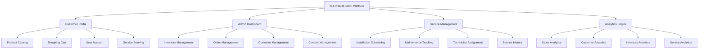
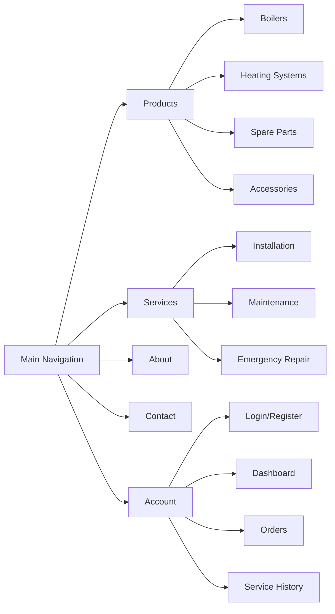
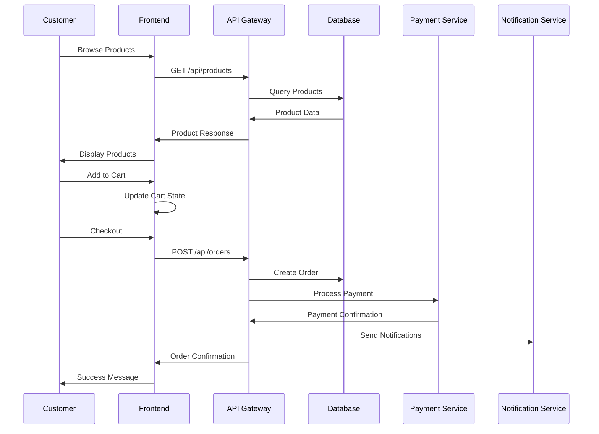
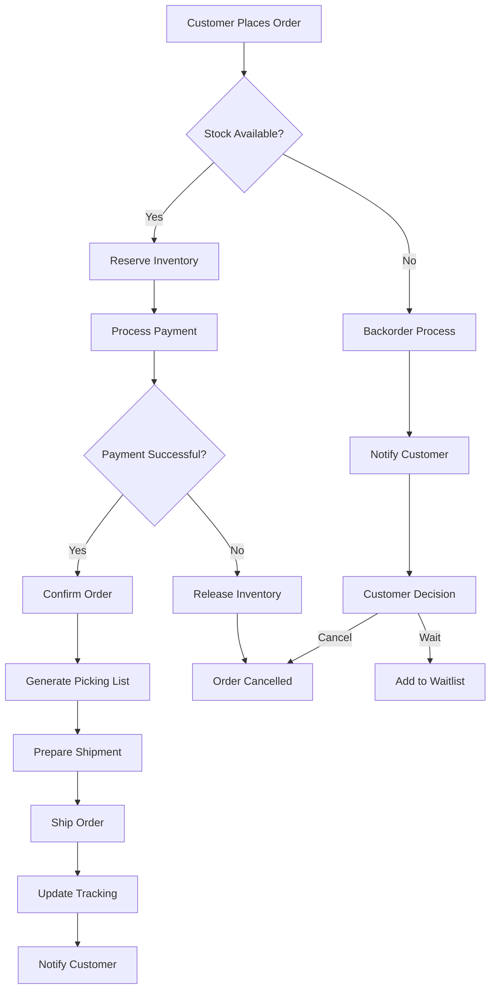
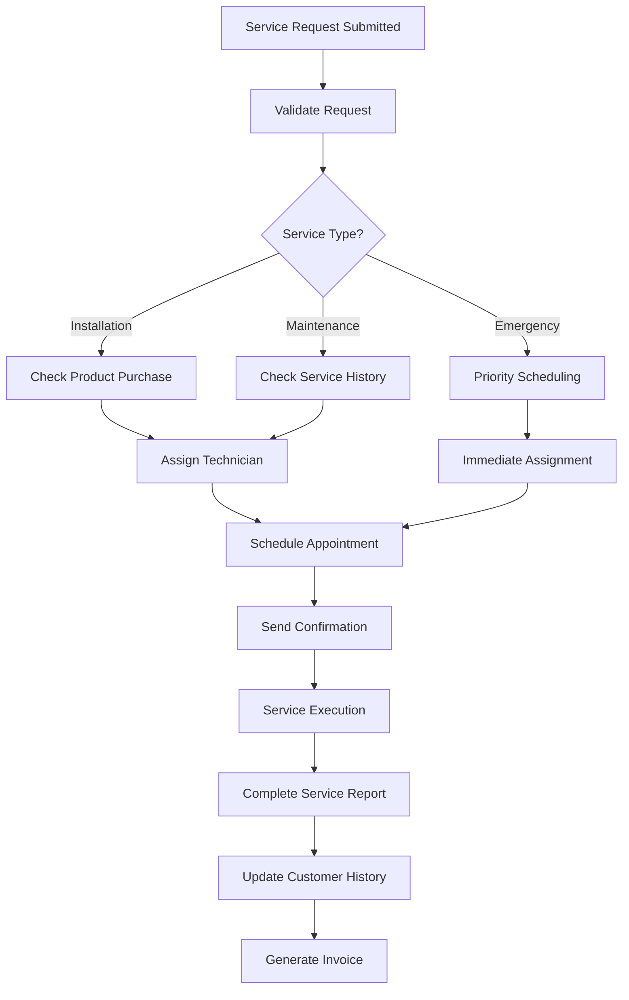
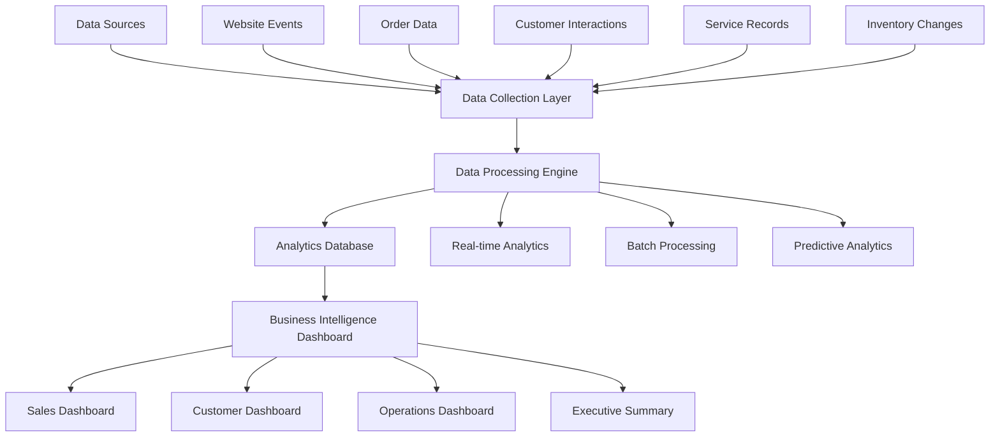

# MJ CHAUFFAGE E-commerce Website Design

## 1. Overview

### Business Context
MJ CHAUFFAGE is a specialized heating and plumbing company that requires a comprehensive e-commerce platform to support three core business activities:
- **Product Sales**: Heating equipment, boilers, and spare parts
- **Installation Services**: Professional boiler and heating system installation
- **Maintenance Services**: Ongoing boiler maintenance and repair services

### Primary Objectives
- **Sales-Focused Platform**: Streamlined product discovery and purchasing experience
- **Data-Driven Operations**: Comprehensive tracking and analytics for business intelligence
- **Service Integration**: Seamless integration of product sales with installation and maintenance services
- **Customer Relationship Management**: Enhanced customer journey tracking and retention

### Target Audiences
- **B2B Customers**: Contractors, plumbers, and heating professionals
- **B2C Customers**: Homeowners seeking heating solutions and maintenance
- **Service Clients**: Existing customers requiring ongoing maintenance support

## 2. Technology Stack & Dependencies

### Frontend Framework
- **Modern JavaScript Framework**: React or Vue.js for dynamic user interface
- **Responsive Design**: Mobile-first approach using CSS frameworks
- **Performance Optimization**: Progressive Web App (PWA) capabilities
- **SEO Framework**: Server-side rendering for search engine optimization

### Backend Infrastructure
- **API Architecture**: RESTful API with microservices approach
- **Database Management**: Relational database for complex business data
- **Authentication System**: Secure user authentication and authorization
- **Payment Processing**: Integration with multiple payment gateways

### Analytics & Tracking
- **Business Intelligence Platform**: Real-time analytics dashboard
- **Customer Behavior Tracking**: Comprehensive user journey analytics
- **Inventory Management**: Real-time stock tracking and forecasting
- **Performance Monitoring**: System health and performance metrics

## 3. Component Architecture

### Core Application Components

#### Product Management System
- **Product Catalog Component**: Dynamic product listing with filtering and search
- **Product Detail Component**: Comprehensive product information display
- **Inventory Tracker Component**: Real-time stock level monitoring
- **Price Management Component**: Dynamic pricing with bulk discount capabilities

#### Customer Experience Components
- **User Authentication Component**: Registration, login, and profile management
- **Shopping Cart Component**: Advanced cart with save-for-later functionality
- **Checkout Component**: Multi-step checkout with multiple payment options
- **Order Tracking Component**: Real-time order status and delivery tracking

#### Service Management Components
- **Service Booking Component**: Installation and maintenance appointment scheduling
- **Technician Dashboard Component**: Service request management and tracking
- **Service History Component**: Complete service record for each customer
- **Maintenance Calendar Component**: Scheduled maintenance reminder system

#### Analytics & Reporting Components
- **Sales Dashboard Component**: Real-time sales metrics and performance indicators
- **Customer Analytics Component**: Customer behavior and preference tracking
- **Inventory Analytics Component**: Stock movement and demand forecasting
- **Service Performance Component**: Service efficiency and customer satisfaction metrics

### Component Hierarchy

## 4. Routing & Navigation

### Public Routes
- **Homepage** (`/`): Company overview and featured products
- **Product Catalog** (`/products`): Complete product listing with categories
- **Product Details** (`/products/:id`): Individual product information
- **Services** (`/services`): Installation and maintenance service information
- **About** (`/about`): Company information and expertise
- **Contact** (`/contact`): Contact information and inquiry forms

### Authenticated User Routes
- **User Dashboard** (`/dashboard`): Personal account overview
- **Order History** (`/orders`): Complete purchase and service history
- **Service Requests** (`/services/requests`): Maintenance and installation requests
- **Account Settings** (`/settings`): Profile and preference management

### Administrative Routes
- **Admin Dashboard** (`/admin`): Business overview and key metrics
- **Product Management** (`/admin/products`): Product catalog administration
- **Order Management** (`/admin/orders`): Order processing and fulfillment
- **Customer Management** (`/admin/customers`): Customer relationship management
- **Service Management** (`/admin/services`): Service request and scheduling management
- **Analytics** (`/admin/analytics`): Comprehensive business intelligence dashboard

### Navigation Architecture

## 5. State Management

### Global State Architecture
- **User Authentication State**: Login status, user profile, and permissions
- **Shopping Cart State**: Cart items, quantities, and pricing calculations
- **Product Catalog State**: Product listings, filters, and search results
- **Service Booking State**: Appointment scheduling and service requests
- **Notification State**: System alerts, order updates, and service reminders

### State Management Strategy
- **Context API or Redux**: Centralized state management for complex interactions
- **Local Storage**: Persistent cart and user preference storage
- **Session Management**: Secure authentication token handling
- **Real-time Updates**: WebSocket integration for live order and service updates

## 6. API Integration Layer

### Core API Endpoints

#### Product Management API
| Endpoint | Method | Purpose | Authentication |
|----------|--------|---------|----------------|
| `/api/products` | GET | Retrieve product catalog | Public |
| `/api/products/:id` | GET | Get product details | Public |
| `/api/products/search` | GET | Search products | Public |
| `/api/products/categories` | GET | Get product categories | Public |
| `/api/admin/products` | POST/PUT/DELETE | Manage products | Admin |

#### Order Management API
| Endpoint | Method | Purpose | Authentication |
|----------|--------|---------|----------------|
| `/api/orders` | POST | Create new order | User |
| `/api/orders/:id` | GET | Get order details | User/Admin |
| `/api/orders/history` | GET | User order history | User |
| `/api/admin/orders` | GET | All orders management | Admin |

#### Service Management API
| Endpoint | Method | Purpose | Authentication |
|----------|--------|---------|----------------|
| `/api/services/book` | POST | Book installation/maintenance | User |
| `/api/services/requests` | GET | User service requests | User |
| `/api/services/schedule` | GET/PUT | Manage service schedule | Admin |
| `/api/services/history` | GET | Service history | User/Admin |

#### Analytics API
| Endpoint | Method | Purpose | Authentication |
|----------|--------|---------|----------------|
| `/api/analytics/sales` | GET | Sales performance data | Admin |
| `/api/analytics/customers` | GET | Customer behavior data | Admin |
| `/api/analytics/inventory` | GET | Inventory analytics | Admin |
| `/api/analytics/services` | GET | Service performance metrics | Admin |

### Data Flow Architecture

## 7. Data Models & Business Logic

### Core Data Entities

#### Product Entity
| Field | Type | Description | Constraints |
|-------|------|-------------|-------------|
| id | UUID | Unique product identifier | Primary Key |
| name | String | Product name | Required, Max 255 |
| sku | String | Stock keeping unit | Unique, Required |
| category | String | Product category | Required |
| description | Text | Detailed description | Optional |
| price | Decimal | Product price | Required, Min 0 |
| stock_quantity | Integer | Available inventory | Required, Min 0 |
| manufacturer | String | Manufacturer name | Optional |
| specifications | JSON | Technical specifications | Optional |
| images | Array | Product image URLs | Optional |
| created_at | DateTime | Creation timestamp | Auto-generated |
| updated_at | DateTime | Last update timestamp | Auto-generated |

#### Customer Entity
| Field | Type | Description | Constraints |
|-------|------|-------------|-------------|
| id | UUID | Unique customer identifier | Primary Key |
| email | String | Customer email | Unique, Required |
| first_name | String | Customer first name | Required |
| last_name | String | Customer last name | Required |
| phone | String | Contact phone number | Optional |
| company_name | String | Company name (B2B) | Optional |
| customer_type | Enum | B2B or B2C classification | Required |
| addresses | JSON | Billing and shipping addresses | Optional |
| registration_date | DateTime | Account creation date | Auto-generated |
| last_login | DateTime | Last login timestamp | Auto-tracked |

#### Order Entity
| Field | Type | Description | Constraints |
|-------|------|-------------|-------------|
| id | UUID | Unique order identifier | Primary Key |
| customer_id | UUID | Reference to customer | Foreign Key |
| order_number | String | Human-readable order number | Unique |
| status | Enum | Order status | Required |
| total_amount | Decimal | Total order value | Required |
| items | JSON | Order line items | Required |
| shipping_address | JSON | Delivery address | Required |
| payment_status | Enum | Payment confirmation status | Required |
| order_date | DateTime | Order creation timestamp | Auto-generated |
| delivery_date | DateTime | Expected delivery date | Optional |

#### Service Request Entity
| Field | Type | Description | Constraints |
|-------|------|-------------|-------------|
| id | UUID | Unique service request identifier | Primary Key |
| customer_id | UUID | Reference to customer | Foreign Key |
| service_type | Enum | Installation/Maintenance/Repair | Required |
| description | Text | Service requirement description | Required |
| scheduled_date | DateTime | Appointment date and time | Required |
| technician_id | UUID | Assigned technician | Optional |
| status | Enum | Service request status | Required |
| equipment_details | JSON | Equipment information | Optional |
| completion_notes | Text | Service completion report | Optional |
| created_at | DateTime | Request creation timestamp | Auto-generated |

### Business Logic Architecture

#### Order Processing Workflow

#### Service Booking Workflow

## 8. Analytics & Data Tracking Strategy

### Key Performance Indicators (KPIs)

#### Sales Analytics
- **Revenue Metrics**: Total sales, average order value, revenue per customer
- **Product Performance**: Best-selling products, category performance, inventory turnover
- **Conversion Metrics**: Conversion rate, cart abandonment rate, customer acquisition cost
- **Geographic Analytics**: Sales by region, shipping performance, market penetration

#### Customer Analytics
- **Behavior Tracking**: Page views, session duration, product browsing patterns
- **Customer Segmentation**: B2B vs B2C performance, customer lifetime value
- **Retention Metrics**: Repeat purchase rate, customer churn, loyalty program effectiveness
- **Service Integration**: Cross-selling between products and services

#### Operational Analytics
- **Inventory Management**: Stock levels, reorder alerts, demand forecasting
- **Service Operations**: Technician utilization, service completion rates, customer satisfaction
- **Website Performance**: Page load times, mobile vs desktop usage, error rates
- **Marketing Effectiveness**: Campaign performance, traffic sources, ROI tracking

### Analytics Architecture

### Data Collection Strategy

#### Frontend Tracking Events
- **Page Navigation**: Track user journey through the website
- **Product Interactions**: View product details, add to cart, remove from cart
- **Search Behavior**: Search terms, filter usage, result interactions
- **Checkout Process**: Step-by-step checkout funnel analysis
- **Service Inquiries**: Service page visits, contact form submissions

#### Backend Data Collection
- **Order Processing**: Complete order lifecycle tracking
- **Inventory Movement**: Stock changes, supplier interactions
- **Customer Service**: Support ticket creation and resolution
- **Payment Processing**: Transaction success rates and failure analysis
- **API Performance**: Endpoint usage and response times

## 9. Security & Authentication

### Authentication Strategy
- **Multi-Factor Authentication**: Enhanced security for admin and customer accounts
- **Role-Based Access Control**: Granular permissions for different user types
- **Session Management**: Secure token-based authentication with refresh capabilities
- **Password Policy**: Strong password requirements with regular update prompts

### Data Protection
- **Encryption**: End-to-end encryption for sensitive customer and payment data
- **Compliance**: GDPR compliance for EU customers, data retention policies
- **Payment Security**: PCI DSS compliance for credit card processing
- **Audit Logging**: Comprehensive logging of all system access and modifications

## 10. Testing Strategy

### Frontend Testing
- **Unit Testing**: Component-level testing for UI components
- **Integration Testing**: API integration and data flow testing
- **End-to-End Testing**: Complete user journey testing
- **Performance Testing**: Page load times and responsiveness testing
- **Cross-Browser Testing**: Compatibility across different browsers and devices

### Backend Testing
- **API Testing**: Endpoint functionality and data validation testing
- **Database Testing**: Data integrity and performance testing
- **Security Testing**: Authentication and authorization testing
- **Load Testing**: System performance under high traffic conditions
- **Business Logic Testing**: Order processing and service booking workflow testing

### Analytics Testing
- **Data Accuracy Testing**: Verification of analytics data collection and reporting
- **Dashboard Testing**: Business intelligence dashboard functionality
- **Real-time Data Testing**: Live data streaming and update verification
- **Report Generation Testing**: Automated report accuracy and delivery testing

